## Table of Contents

- [Table of Contents](#table-of-contents)
- [👋Introduction](#introduction)
- [🛠️Technologies Used](#️technologies-used)
- [🌟Features](#features)
- [🚀 Live Demo](#-live-demo)
- [📸 Screenshots](#-screenshots)
  - [🏠Home Page](#home-page)
  - [🏠 Tour part1](#-tour-part1)
  - [🏠 Tour part2](#-tour-part2)
  - [🏠 Tour part3](#-tour-part3)
  - [🏠 Tour part4](#-tour-part4)
  - [🏠 Tour part5](#-tour-part5)
  - [🏠 Tour part6](#-tour-part6)
  - [🏠 Booking Tour Page](#-booking-tour-page)
  - [🏠 Tours That user Booked Page](#-tours-that-user-booked-page)
  - [🏠 My Reviews Page](#-my-reviews-page)
  - [🔑Login Page](#login-page)
  - [🔑 SignUp Page](#-signup-page)
  - [:email: Welcome Email After Sign Up](#email-welcome-email-after-sign-up)
  - [🔑 Forget Password Page](#-forget-password-page)
  - [🔑 acount info update](#-acount-info-update)
  - [🔑 PASSWORD CHANGE](#-password-change)
- [🏁Getting Started](#getting-started)
- [⬇️Installation](#️installation)
- [📄License](#license)
- [🕴 Contributors ](#-contributors-)

## 👋Introduction

It is a full stack tours website that shows the information about all the tours of this company and making the clients able to book them.

Each user has information like name, email, role(**admin**, **lead guide**, **guide**, or **user**), password and maybe a photo. He can update his information at any time, log in, and log out, Sign Up, Forget Password, Update Password, Reset Password, Update information.

Each tour has name, duration, maximum group size, difficulty(hard, medium or easy), reviews, price, summary, description, cover image, images, start dates, start location, locations and guides.

## 🛠️Technologies Used

The Natours Full Stack project utilizes the following technologies:

- ### Front End
  - [React](https://reactjs.org/)
  - [Redux Toolkit](https://redux-toolkit.js.org/)
  - [React Router](https://reactrouter.com/)
  - [react query](https://react-query.tanstack.com/)
  - [Axios](https://axios-http.com/)
  - [formik](https://formik.org/)
  - [yup](https://www.npmjs.com/package/yup)
  - [react toastify](https://fkhadra.github.io/react-toastify/introduction)
  - [react map gl](https://visgl.github.io/react-map-gl/)
  - [react icons](https://react-icons.github.io/react-icons/)
  - [StripeJs](https://stripe.com/docs/js)
  - [react-loading-skeleton](https://www.npmjs.com/package/react-loading-skeleton)
  - [Tailwind CSS](https://tailwindcss.com/)
- ## Back End
- [Node.js](https://nodejs.org/en/)
- [Express](https://expressjs.com/)
- [MongoDB](https://www.mongodb.com/)
- [Mongoose](https://mongoosejs.com/)
- [JWT](https://jwt.io/)
- [bcrypt](https://www.npmjs.com/package/bcrypt)
- [nodemailer](https://nodemailer.com/about/)
- [stripe](https://stripe.com/docs/api)
- [sharp](https://www.npmjs.com/package/sharp)
- [multer](https://www.npmjs.com/package/multer)
- [slugify](https://www.npmjs.com/package/slugify)
- [validator](https://www.npmjs.com/package/validator)
- [helmet](https://helmetjs.github.io/)
- [xss-clean](https://www.npmjs.com/package/xss-clean)
- [hpp](https://www.npmjs.com/package/hpp)
- [express-rate-limit](https://www.npmjs.com/package/express-rate-limit)
- [cors](https://www.npmjs.com/package/cors)
- [compression](https://www.npmjs.com/package/compression)

## 🌟Features

- All authentication features (login , sign up , forget password , update password , reset password and update information).
- All authorization features (admin , lead guide , guide and user).
- Uploading images, resizing images.
- Sending emails.
- Payment with stripe.
- Security best practices like :rate limiting , data sanitization, preventing parameter pollution and
  security Headers
- All CRUD operations for tours, reviews, users and bookings.
- Advanced filtering, sorting, pagination and aliasing.
- Geospatial queries.
- Aggregation pipeline.
- Error handling and sending error messages in development and production.
- Handling unhandled rejections and uncaught exceptions.
- Form validation using formik, yup.
- Fetching data using Axios and react query.
- Using react toastify to show toast messages.
- Using react map gl to show the map.

## 🚀 Live Demo

[Natours Website](https://natours-front-end-psi.vercel.app/)

## 📸 Screenshots

### 🏠Home Page

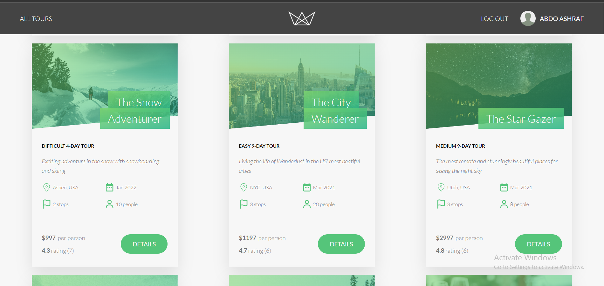

### 🏠 Tour part1


### 🏠 Tour part2

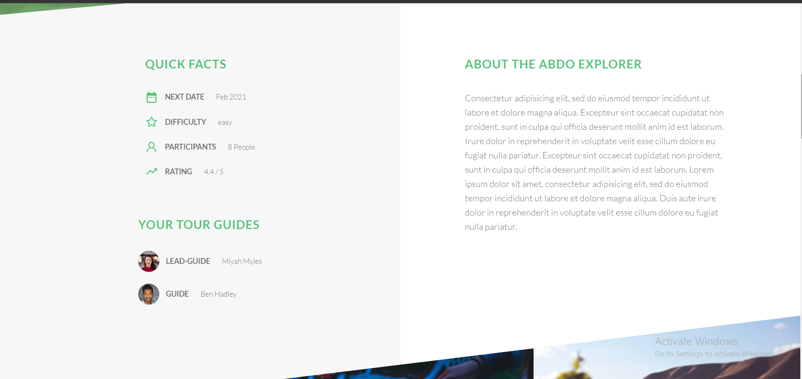

### 🏠 Tour part3

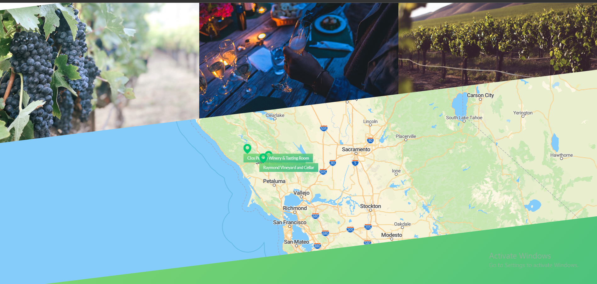

### 🏠 Tour part4

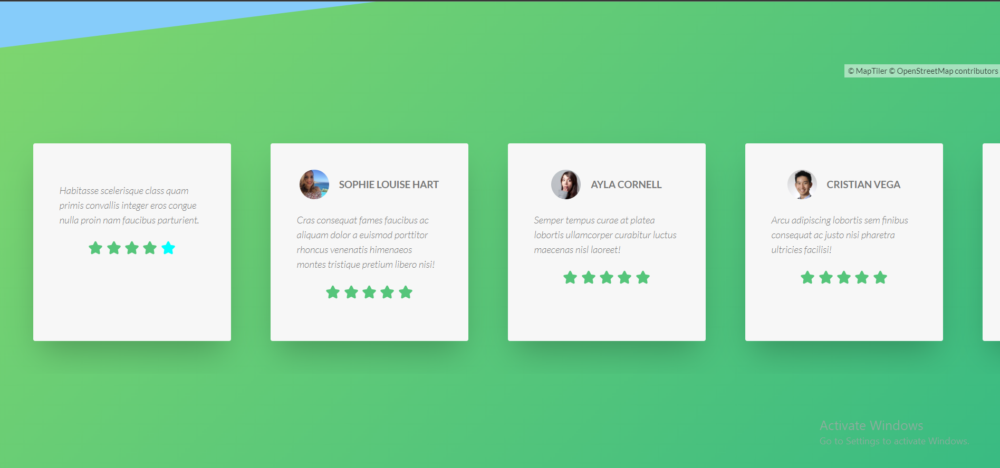

### 🏠 Tour part5

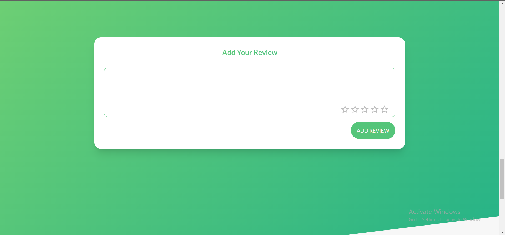

### 🏠 Tour part6

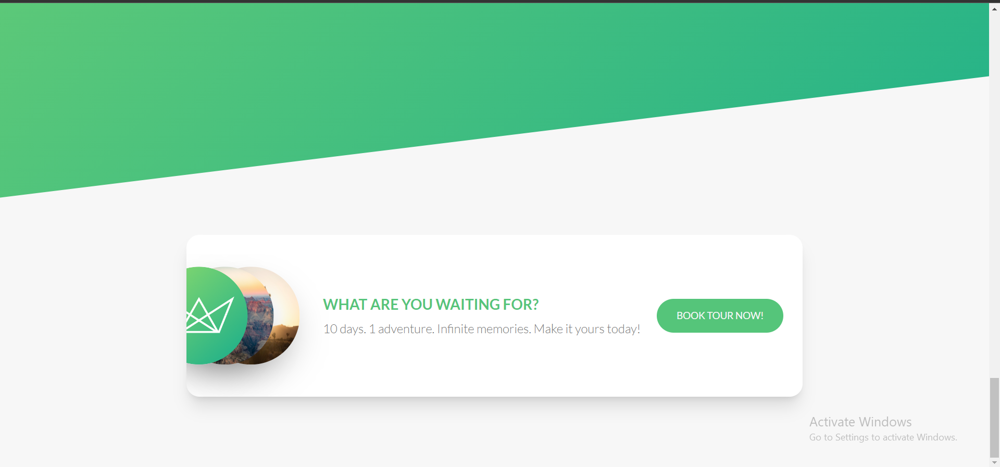

### 🏠 Booking Tour Page

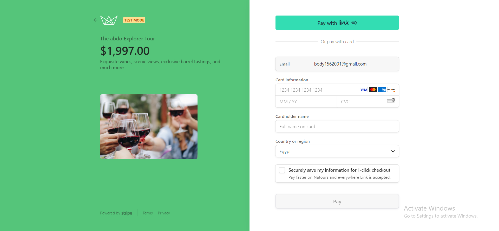

### 🏠 Tours That user Booked Page

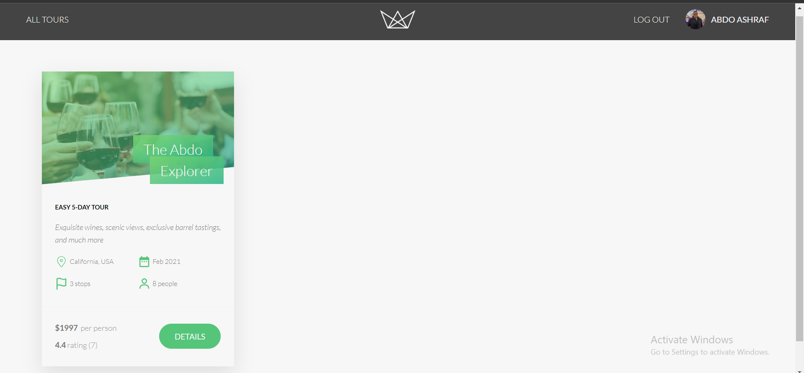

### 🏠 My Reviews Page

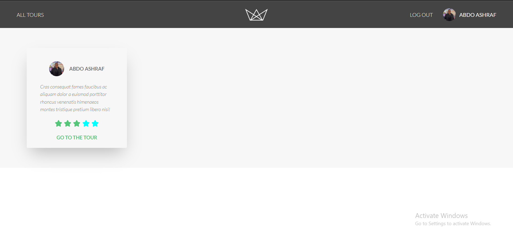

### 🔑Login Page

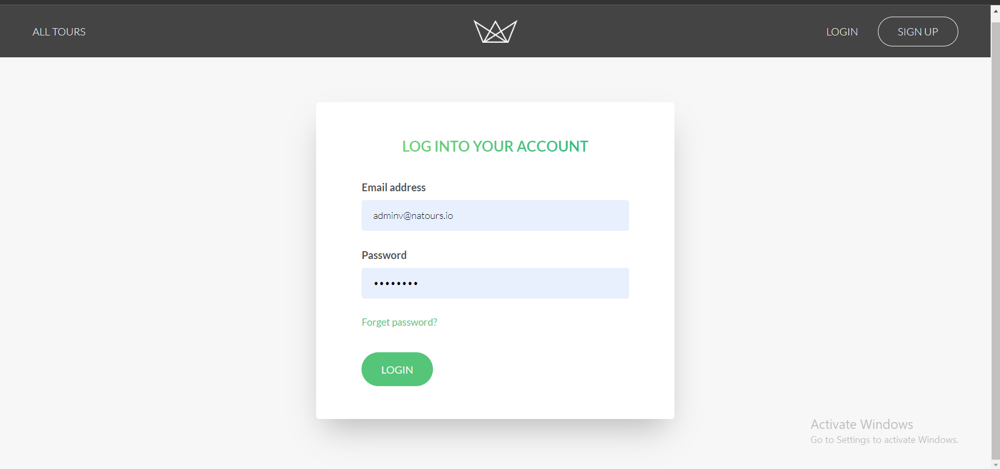

### 🔑 SignUp Page


### :email: Welcome Email After Sign Up

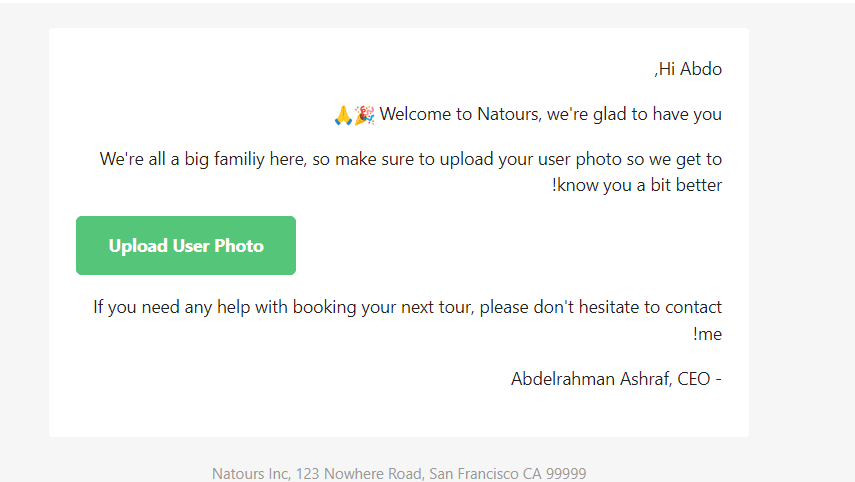

### 🔑 Forget Password Page

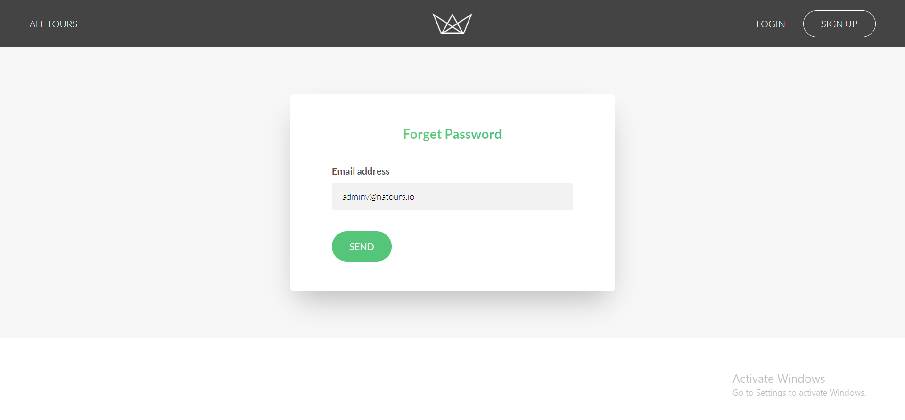

### 🔑 acount info update

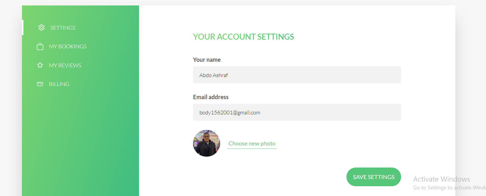

### 🔑 PASSWORD CHANGE

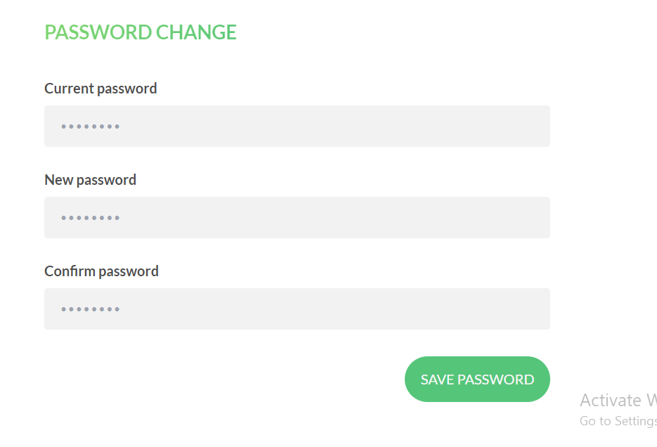

## 🏁Getting Started

To set up the Natours Full Stack project locally, follow the instructions below.

## ⬇️Installation

1. Clone the repository:

   ```bash
   https://github.com/AbdelrahmanAshrafMohamedelsayed/Natours-Full-Stack-Project.git
   ```

2. go to server folder:

   ```bash
   cd server
   ```

3. Install the dependencies:

   ```bash
    npm install
   ```

4. Create a .env file and add the following environment variables:

   ```env
    NODE_ENV=development
    PORT=[PORT]
    DATABASE=[CONNECTION STRING OF YOUR DATABASE]
    USERNAME= [DATABASE USER NAME]
    DATABASE_PASSWORD=[YOUR DATABASE PASSWORD]
    FRONTEND_URL=http://localhost:5173
    JWT_SECRET=[YOUR JWT SECRET STRING]
    JWT_EXPIRES_IN=[DATE example: 1d "for one day"]
    JWT_COOKIE_EXPIRES_IN= [Date example: 1 "for one day"]
    EMAIL_USERNAME=[YOUR EMAIL]
    EMAIL_PASSWORD=[YOUR EMAIL PASSWORD]
    EMAIL_HOST=[YOUR EMAIL HOST]
    EMAIL_PORT=[YOUR EMAIL PORT]
    EMAIL_FROM=[YOUR EMAIL]
    SENDGRID_USERNAME=[YOUR SENDGRID USERNAME]
    SENDGRID_PASSWORD=[YOUR SENDGRID PASSWORD]
    Stripe_Secret_Key=[YOUR STRIPE SECRET KEY]
   ```

5. Run the development server:

   ```bash
   npm run dev
   ```

6. go to client folder:

   ```bash
   cd client
   ```

7. Install the dependencies:

   ```bash
    npm install
   ```

8. Create a .env file and add the following environment variables:

   ```env
   VITE_NATOURS_API_BACKEND_URL=http://127.0.0.1:3000
   ```

9. Run the client:

   ```bash
    npm run dev
   ```

10. Open your browser and navigate to [http://localhost:5173/](http://localhost:5173/) to access Natours application.

## 📄License

The Natours project is open-source and is licensed under the [MIT License](https://github.com/AbdelrahmanAshrafMohamedelsayed/Natours-Full-Stack-Project/blob/main/LICENSE) .

## 🕴 Contributors <a name = "Contributors"></a>

<table>
  <tr>
   <td align="center"><a href="https://github.com/AbdelrahmanAshrafMohamedelsayed"><br /><sub><b>Abdelrahman Ashraf</b></sub></a><br/></td>

  </tr>
 </table>
